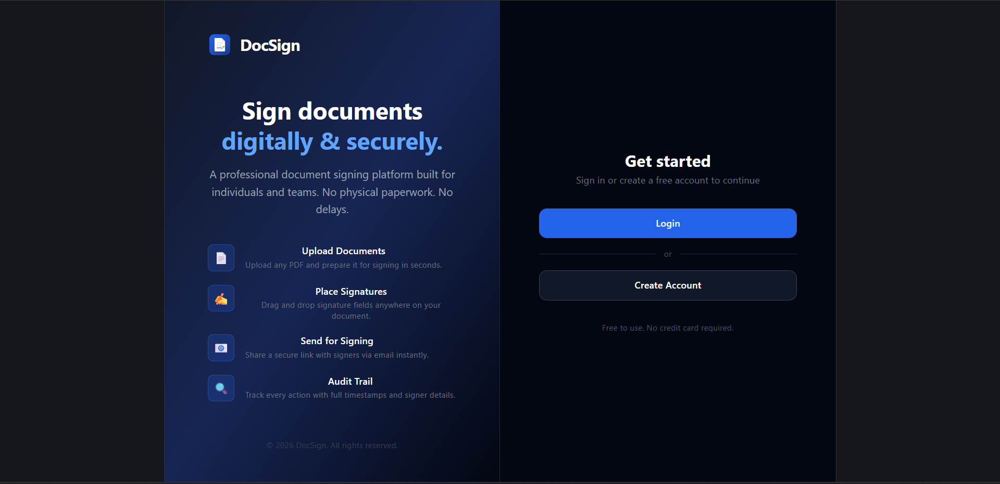
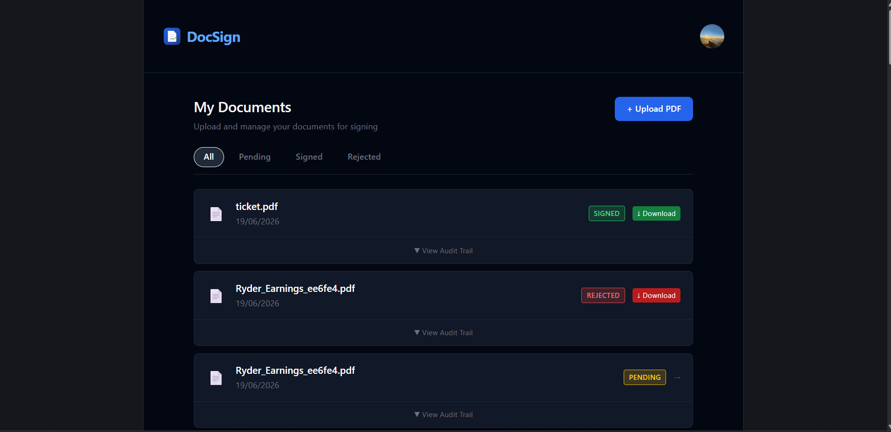
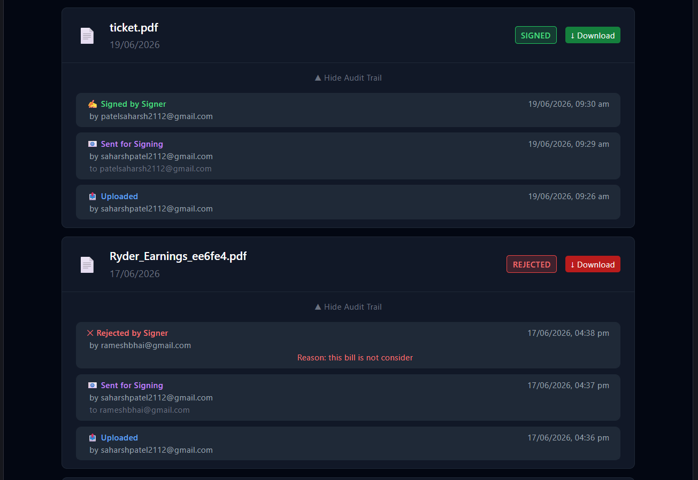
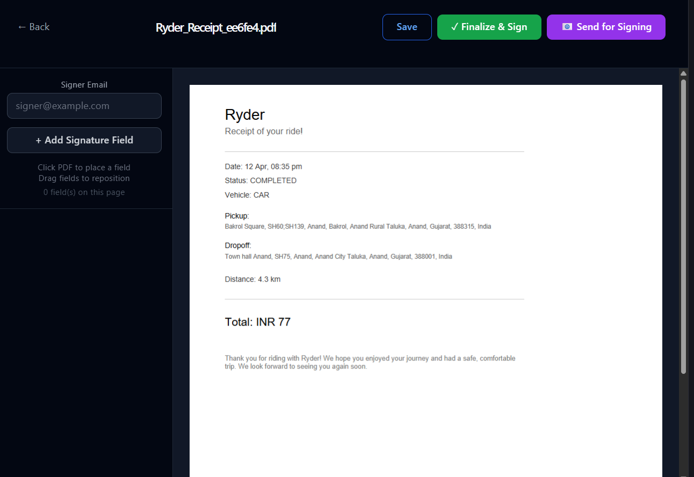

# DocSign

A full-stack document signing platform. Upload a PDF, place signature fields with drag-and-drop, send a secure signing link to a signer, and generate a finalized signed PDF — with a full audit trail of every action taken.

**Live app:** https://docsign-ruby.vercel.app
<br>**API:** https://docsign-server-4s23.onrender.com

---

## What it does

- Upload a PDF document
- Place one or more signature fields directly on the PDF by clicking, then drag to reposition
- Save signature positions tied to exact page coordinates
- Generate a secure, tokenized signing link and copy it for sharing (auto-copies to clipboard)
- Signer opens the link (no login required), reviews the document, and signs or rejects it with a reason
- On signing, the app embeds the signature into the actual PDF using `pdf-lib` and produces a final signed file
- Every action — upload, send, sign, reject, finalize — is logged with actor, timestamp, and IP address in an audit trail visible per document
- Dashboard with status filters (pending / signed / rejected) and downloadable signed PDFs

---

## Screenshots

**Login / Sign up**


**Dashboard — documents with status filters**


**Audit trail — per-document action history**


**Public signing page**



---

## Known limitation

**Email delivery does not work on the deployed version.** Signing links are sent via Nodemailer over Gmail SMTP, and this works correctly in local development. On Render's free tier, however, outbound SMTP connections (ports 587/465) are blocked at the network level — every send attempt times out (`ETIMEDOUT`), so no email reaches the signer in production.

This does not break the core flow: the signing link is always generated and copied to the clipboard regardless of whether the email sends, so the document owner can still share it manually. The failure is caught and logged server-side rather than crashing the request.

The fix is to replace Gmail SMTP with an HTTP-based email API (Resend or SendGrid), since those send over HTTPS rather than a blocked SMTP port. Not done here due to time constraints on the original 14-day build schedule.

---

## Tech stack

### Frontend — React + TypeScript (Vite)

- **React 18 + TypeScript** — type safety across components and API responses, catches integration bugs (mismatched payload shapes, missing fields) at compile time rather than in production.
- **Vite** — chosen over CRA for faster dev server startup and HMR; no build-time overhead during active development.
- **Tailwind CSS v3** — utility-first styling kept the UI iteration fast across 13 days of layout changes without fighting a CSS file.
- **react-pdf** — renders the PDF directly in-browser using `pdf.js` under the hood, used both for the signature placement editor and the read-only signer view.
- **Manual drag implementation (not dnd-kit)** — dnd-kit's transform-based positioning conflicted with the percentage-based absolute coordinates needed to keep signature fields correctly anchored across different screen sizes. Switched to a `mousedown`/`mousemove`/`mouseup` listener pattern that converts pixel deltas to percentage offsets directly against the PDF container's bounding box.
- **React Router** — client-side routing for dashboard, editor, and the public signing page (`/sign/:token`), which intentionally sits outside the authenticated route guard.
- **Axios** — centralized API client with an interceptor-style token setter (`setAuthToken`) synced to Clerk's session token on every authenticated request.
- **Clerk (React SDK)** — handles sign-up, sign-in, session management, and the account/profile UI. Used over a hand-rolled auth system to avoid building password reset, session expiry, and account management from scratch.

### Backend — Node.js + Express + TypeScript

- **Express** — REST API with route-level middleware for auth (`requireAuth`).
- **Multer (memory storage)** — handles PDF upload as an in-memory buffer, which is then streamed directly to Supabase Storage rather than touching disk — necessary since Render's filesystem is ephemeral and wipes on every redeploy.
- **pdf-lib** — server-side PDF manipulation; loads the original PDF, draws signature boxes at the stored coordinates (converted from percentage to absolute PDF point coordinates, accounting for PDF's bottom-left origin), and outputs a new signed PDF buffer.
- **JWT decoding (manual, not full verification)** — the auth middleware decodes the Clerk session JWT's payload directly (base64-decoded) to extract `userId` and `email` rather than calling Clerk's backend SDK per-request, after the SDK's verification API surface proved inconsistent across versions during development. This is a pragmatic tradeoff for a portfolio project; production-grade auth would verify the JWT signature against Clerk's JWKS endpoint rather than trusting the payload as-is.
- **Nodemailer** — sends the signing link to the signer's email via Gmail SMTP, triggered from the share route. See **Known limitation** below.
- **uuid** — generates the signing token used in the public `/sign/:token` link; one token is shared across all signature fields belonging to a document so a signer's single click-through covers every field on that document.

### Database & Storage — Supabase (PostgreSQL + Storage)

- **PostgreSQL** — three core tables: `documents`, `signatures`, `audit_logs`, related by foreign keys (`document_id`).
- **Supabase Storage** — private bucket (`documents`) holds both original uploads and finalized signed PDFs. Access is via short-lived signed URLs generated server-side using the service role key, rather than public bucket access.
- **Row Level Security** — enabled on `documents` and `signatures`; the backend uses the Supabase service role key (which bypasses RLS) for all writes, so RLS here primarily protects against any future client-side direct-access path.

### Authentication — Clerk

- Email/password authentication, session handling, and account management UI (`UserButton`) on the frontend.
- The signing flow for external signers (`/sign/:token`) deliberately does **not** require Clerk auth — a signer should not need an account to sign a document they were sent.

---

## Architecture notes

**Why coordinates are stored as percentages, not pixels.** Signature field positions are saved as `x`/`y` percentages of the PDF page dimensions, not absolute pixel values. This means a field placed on a document rendered at 600px wide in the editor still lands in the correct spot when the same document is rendered at a different width on the public signing page or embedded into the final PDF at full page size. Converting percentage → PDF point coordinates happens once, server-side, in `generateSignedPdf.ts`.

**Why the signed PDF is generated twice in the codebase** — once when the document owner clicks "Finalize & Sign" directly, and again when an external signer completes signing via the link. These are two distinct flows: the owner finalizing is a self-sign action; the signer completing via token triggers its own PDF generation because the act of an external party signing is what should produce the legally-relevant signed artifact, not the owner's earlier draft placement of fields.

**Why audit logs never throw.** `logAudit()` swallows its own errors internally rather than letting a logging failure break the primary action (upload, sign, reject). An audit trail that's occasionally incomplete is preferable to a working feature that crashes because a non-critical log write failed.

---

## Project structure

```
docsign/
├── client/                  # React + Vite frontend
│   └── src/
│       ├── components/      # UploadDocument, DocumentList, SignatureField, AuditLog, ProtectedRoute, AuthSync
│       ├── pages/            # Dashboard, DocumentEditor, LoginPage, SigningPage
│       └── lib/               # axios instance, supabase client
└── server/                  # Express + TypeScript backend
    └── src/
        ├── routes/           # documents, signatures, share, audit, user
        ├── middleware/        # requireAuth (JWT payload decode)
        └── lib/                # supabase client, generateSignedPdf, sendEmail, audit
```

---

## Setup

### Prerequisites

- Node.js 18+
- A Supabase project (PostgreSQL + Storage)
- A Clerk application

### Environment variables

**`server/.env`**
```
SUPABASE_URL=
SUPABASE_SERVICE_ROLE_KEY=
CLERK_SECRET_KEY=
EMAIL_USER=
EMAIL_PASS=
FRONTEND_URL=http://localhost:5173
PORT=5000
```

**`client/.env`**
```
VITE_CLERK_PUBLISHABLE_KEY=
VITE_API_URL=http://localhost:5000
VITE_SUPABASE_URL=
VITE_SUPABASE_ANON_KEY=
```

### Database

Run the schema (tables: `documents`, `signatures`, `audit_logs`) and create a private Storage bucket named `documents` in your Supabase project. See `/server/src/lib` for the exact columns each route expects.

### Install & run

```bash
# Backend
cd server
npm install
npm run dev

# Frontend
cd client
npm install
npm run dev
```

---

## Deployment

- **Frontend** — Vercel (root directory: `client`, framework: Vite)
- **Backend** — Render (root directory: `server`, build: `npm install && npm run build`, start: `npm start`)

Both are configured to redeploy automatically on push to `main`.
